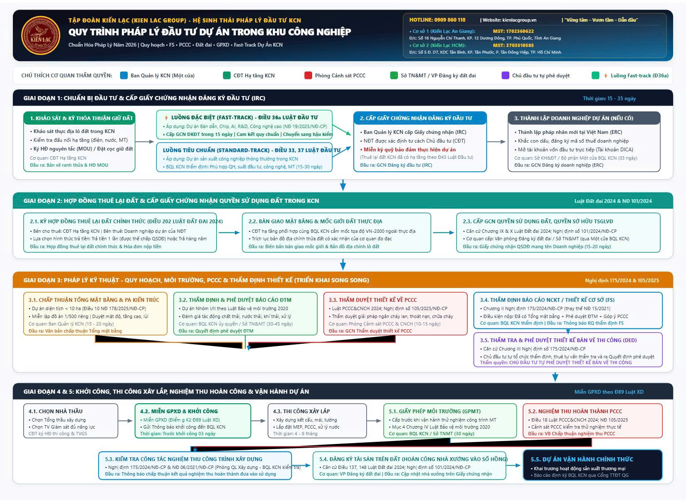

# CẨM NANG & QUY TRÌNH PHÁP LÝ ĐẦU TƯ PHÁT TRIỂN DỰ ÁN TRONG KHU CÔNG NGHIỆP
*(Dành cho Nhà đầu tư thứ cấp thuê lại đất xây dựng nhà máy / cơ sở sản xuất kinh doanh trong KCN)*

<p align="center">
  <br>
  <strong style="font-size: 1.3rem; color: #1e3a8a;">TẬP ĐOÀN KIẾN LẠC (KIEN LAC GROUP)</strong><br>
  <em>HỆ SINH THÁI TƯ VẤN QUY HOẠCH, PHÁP LÝ ĐẦU TƯ &amp; QUẢN TRỊ DỰ ÁN KCN</em>
</p>

> **🏛️ CƠ SỞ 1: CÔNG TY CỔ PHẦN TƯ VẤN NGHIÊN CỨU PHÁT TRIỂN VÀ ĐẦU TƯ KIẾN LẠC (KIẾN LẠC AN GIANG)**
> - **Mã số thuế:** `1702360622`
> - **Địa chỉ:** Số 16, đường Nguyễn Chí Thanh, Khu phố 12 Dương Đông, Đặc khu Phú Quốc, Tỉnh An Giang, Việt Nam.
>
> **🏛️ CƠ SỞ 2: CÔNG TY CỔ PHẦN TƯ VẤN PHÁT TRIỂN VÀ ĐẦU TƯ XÂY DỰNG KIẾN LẠC (KIẾN LẠC TP. HỒ CHÍ MINH)**
> - **Mã số thuế:** `3703510585`
> - **Địa chỉ:** Số 5 đường D7, KDC Phát triển đô thị Tân Bình, KP Tân Phước, phường Tân Đông Hiệp, TP. Hồ Chí Minh.
>
> **📞 HOTLINE TOÀN HỆ THỐNG:** `0909 860 118`  |  **🌐 Website:** `kienlacgroup.vn`  |  *Khẩu hiệu: "Vững tâm – Vươn tầm – Dẫn đầu"*

---

**Phiên bản chuẩn hóa & Cập nhật mới nhất: Năm 2026**
**Đơn vị thực hiện: Ban Pháp lý & Phát triển Dự án - KIEN LAC GROUP**

---

## MỤC LỤC
1. [TỔNG QUAN VÀ BỐI CẢNH PHÁP LÝ NĂM 2026](#1-tổng-quan-và-bối-cảnh-pháp-lý-năm-2026)
2. [BẢNG TRA CỨU, RÀ SOÁT VÀ ĐỐI CHIẾU CĂN CỨ PHÁP LÝ TỪ BẢN CŨ (20260100)](#2-bảng-tra-cứu-rà-soát-và-đối-chiếu-căn-cứ-pháp-lý-từ-bản-cũ-20260100)
3. [SƠ ĐỒ QUY TRÌNH TỔNG THỂ DỰ ÁN TRONG KHU CÔNG NGHIỆP (WORKFLOW NĂM 2026)](#3-sơ-đồ-quy-trình-tổng-thể-dự-án-trong-khu-công-nghiệp-workflow-năm-2026)
4. [SỔ TAY QUY TRÌNH CHI TIẾT TỪNG BƯỚC (SOP 5 GIAI ĐOẠN)](#4-sổ-tay-quy-trình-chi-tiết-từng-bước-sop-5-giai-đoạn)
   - [GIAI ĐOẠN 1: Chuẩn bị đầu tư & Cấp Giấy chứng nhận đăng ký đầu tư (GCN ĐKĐT)](#giai-đoạn-1-chuẩn-bị-đầu-tư--cấp-giấy-chứng-nhận-đăng-ký-đầu-tư-gcn-đkđt)
   - [GIAI ĐOẠN 2: Thuê lại đất & Xác lập quyền sử dụng đất trong KCN](#giai-đoạn-2-thuê-lại-đất--xác-lập-quyền-sử-dụng-đất-trong-kcn)
   - [GIAI ĐOẠN 3: Quy hoạch, Môi trường & Thiết kế xây dựng](#giai-đoạn-3-quy-hoạch-môi-trường--thiết-kế-xây-dựng)
   - [GIAI ĐOẠN 4: Lựa chọn nhà thầu, Khởi công & Thi công xây dựng](#giai-đoạn-4-lựa-chọn-nhà-thầu-khởi-công--thi-công-xây-dựng)
   - [GIAI ĐOẠN 5: Nghiệm thu hoàn thành, Hoàn công tài sản & Vận hành dự án](#giai-đoạn-5-nghiệm-thu-hoàn-thành-hoàn-công-tài-sản--vận-hành-dự-án)
5. [CƠ CHẾ ĐẶC THÙ & ĐỘT PHÁ MỚI: THỦ TỤC ĐẦU TƯ ĐẶC BIỆT (FAST-TRACK)](#5-cơ-chế-đặc-thù--đột-phá-mới-thủ-tục-đầu-tư-đặc-biệt-fast-track)
6. [MA TRẬN TIẾN ĐỘ THỰC HIỆN SONG SONG (PARALLEL TRACKING TIMELINE)](#6-ma-trận-tiến-độ-thực-hiện-song-song-parallel-tracking-timeline)
7. [NHỮNG ĐIỂM NGHẼN PHÁP LÝ (BOTTLENECKS) & KHUYẾN NGHỊ TỪ CHUYÊN GIA](#7-những-điểm-nghẽn-pháp-lý-bottlenecks--khuyến-nghị-từ-chuyên-gia)

---

## 1. TỔNG QUAN VÀ BỐI CẢNH PHÁP LÝ NĂM 2026

Hệ thống pháp luật điều chỉnh hoạt động đầu tư phát triển dự án công nghiệp tại Việt Nam bước vào giai đoạn 2025 - 2026 với những thay đổi mang tính **cách mạng, đồng bộ và phân cấp tối đa**, bắt nguồn từ việc có hiệu lực của một loạt đạo luật nền tảng:
- **Luật Đất đai 2024 (Luật số 31/2024/QH15)** có hiệu lực từ ngày 01/08/2024 (cùng Nghị định 101/2024/NĐ-CP về đăng ký đất đai, cấp GCN; Nghị định 102/2024/NĐ-CP hướng dẫn thi hành);
- **Luật Phòng cháy, chữa cháy và Cứu nạn, cứu hộ 2024 (Luật số 55/2024/QH15)** có hiệu lực từ ngày 01/07/2025 (cùng Nghị định 105/2025/NĐ-CP);
- **Luật Quy hoạch đô thị và nông thôn 2024 (Luật số 47/2024/QH15)** có hiệu lực từ ngày 01/07/2025 (cùng Nghị định 178/2025/NĐ-CP);
- **Luật số 57/2024/QH15** sửa đổi 4 luật (Quy hoạch, Đầu tư, PPP, Đấu thầu) có hiệu lực từ ngày 15/01/2025, đặc biệt bổ sung **Điều 36a về Thủ tục đầu tư đặc biệt tại KCN/KKT/KCNC** hướng dẫn chi tiết bởi **Nghị định số 19/2025/NĐ-CP**;
- **Luật Đầu tư (sửa đổi)** (Luật số 143/2025/QH15) có hiệu lực thi hành từ ngày 01/03/2026;
- **Nghị định số 175/2024/NĐ-CP** (ban hành ngày 30/12/2024) quy định chi tiết Luật Xây dựng về quản lý hoạt động xây dựng, **chính thức thay thế hoàn toàn Nghị định số 15/2021/NĐ-CP**;
- **Nghị định số 35/2022/NĐ-CP** về quản lý khu công nghiệp và khu kinh tế tiếp tục khẳng định thẩm quyền giải quyết "Một cửa, tại chỗ" của Ban Quản lý KCN.

Tài liệu này được biên soạn nhằm rà soát, đánh giá, hiệu chỉnh toàn bộ các sai sót, điểm mờ và cập nhật văn bản thay thế từ file sơ đồ `20260100.quy trinh phap ly dau tu DA trong KCN.pdf`, tạo nên cẩm nang chuẩn mực pháp lý cao nhất cho Ban Lãnh đạo và Bộ phận Phát triển Dự án.

---

## 2. BẢNG TRA CỨU, RÀ SOÁT VÀ ĐỐI CHIẾU CĂN CỨ PHÁP LÝ TỪ BẢN CŨ (20260100)

| STT | Căn cứ pháp lý trong file cũ (20260100) | Trạng thái hiệu lực đến năm 2026 | Căn cứ pháp lý Thay thế / Sửa đổi, Bổ sung chuẩn xác | Đánh giá & Lưu ý chuyên môn sâu |
| :---: | :--- | :--- | :--- | :--- |
| **1** | **Điều 19 Luật Đầu tư 2020** (NĐT lập & trình đề xuất dự án đầu tư) | **Sai lệch số điều khoản** *(Điều 19 quy định về ưu đãi đầu tư đặc biệt, không phải nội dung đề xuất dự án)* | **Điều 33 Luật Đầu tư 2020** (hoặc Luật Đầu tư số 143/2025/QH15); kết hợp **Điều 37, 38** về cấp GCN ĐKĐT. | Bản cũ dẫn sai số điều. Nội dung hồ sơ đề xuất dự án đầu tư được luật định tại **Điều 33 Luật Đầu tư**. Đối với dự án thứ cấp trong KCN đã có hạ tầng, thông thường không thuộc diện chấp thuận chủ trương đầu tư, nộp hồ sơ xin cấp GCN ĐKĐT theo Điều 37, 38. |
| **2** | **Điều 37 - 40 Luật Đầu tư 2020; Mục 3 Chương IV Nghị định 31/2021/NĐ-CP** (Cấp GCN ĐKĐT) | **Đã sửa đổi & Bổ sung** bởi Luật số 57/2024/QH15; Luật Đầu tư 2025 (143/2025/QH15); Nghị định 19/2025/NĐ-CP | **Điều 37, 38 Luật Đầu tư 2020 (sửa đổi bổ sung); Điều 36a Luật Đầu tư (Thủ tục đầu tư đặc biệt)**; Nghị định 31/2021/NĐ-CP; **Nghị định 19/2025/NĐ-CP**. | **Điểm đột phá mới:** Nếu dự án thuộc nhóm công nghệ cao, vi mạch bán dẫn, linh kiện điện tử, trung tâm R&D... thực hiện theo cơ chế **Fast-track** (Điều 36a Luật Đầu tư & NĐ 19/2025/NĐ-CP) với thời gian cấp GCN ĐKĐT chỉ trong vòng **15 ngày**, miễn nhiều thủ tục tiền kiểm. |
| **3** | **Điều 43 Luật Đầu tư 2020; Điều 25 Nghị định 31/2021/NĐ-CP** (Bảo đảm thực hiện dự án - Ký quỹ) | **Còn hiệu lực** nhưng **chú thích trong bản cũ bị sai bản chất** | **Khoản 1 Điều 43 Luật Đầu tư 2020**; Điều 25 Nghị định 31/2021/NĐ-CP | Bản cũ ghi *"NĐT trong nước không bắt buộc"* là **sai luật**. Luật không phân biệt NĐT trong nước hay nước ngoài. NĐT được **miễn ký quỹ** nếu: (1) Được thuê đất đã hoàn thiện hạ tầng kỹ thuật trong KCN; hoặc (2) Đấu giá/Đấu thầu; hoặc (3) Nhận chuyển nhượng tài sản. Cần chỉnh sửa bản chất: Dự án thuê lại đất KCN đã có hạ tầng thì **không phải ký quỹ bảo đảm thực hiện dự án với Nhà nước**. |
| **4** | **Điều 10, Điều 9 Nghị định 178/2025/NĐ-CP; Khoản 7 Điều 31 NĐ 178/2025/NĐ-CP** (Quy hoạch xây dựng) | **Đang có hiệu lực** | **Luật Quy hoạch đô thị và nông thôn 2024 (Luật số 47/2024/QH15)**; **Nghị định 178/2025/NĐ-CP**; **Nghị định 35/2022/NĐ-CP** (Điều 31) | Bản cũ đã đón đầu đúng Nghị định 178/2025/NĐ-CP thi hành Luật Quy hoạch đô thị và nông thôn 2024. Dự án công trình trong KCN có quy mô lô đất < 10 ha chỉ cần lập **Tổng mặt bằng và phương án kiến trúc công trình** trình Ban Quản lý KCN thẩm định, phê duyệt mà không phải lập đồ án quy hoạch chi tiết 1/500 riêng biệt. |
| **5** | **Chương 10 Luật Đất đai 2024** (Giấy chứng nhận QSDĐ) | **Đang có hiệu lực** *(Cần chuẩn hóa tên gọi & bổ sung Nghị định hướng dẫn)* | **Chương IX & X Luật Đất đai 2024 (Luật số 31/2024/QH15)**; **Điều 202 Luật Đất đai 2024**; **Nghị định 101/2024/NĐ-CP**; **Nghị định 102/2024/NĐ-CP** | Tên gọi pháp lý chính xác theo Luật Đất đai 2024 là: **"Giấy chứng nhận quyền sử dụng đất, quyền sở hữu tài sản gắn liền với đất"**. NĐT thứ cấp thuê lại đất từ CĐT hạ tầng KCN (Điều 202), được cấp Giấy chứng nhận và hoàn công tài sản trên đất theo Nghị định 101/2024/NĐ-CP. |
| **6** | **Chương 2, Chương 3 Nghị định 175/2024/NĐ-CP** (Thẩm định FS, Thẩm định Thiết kế BVTC) | **Đang có hiệu lực** *(Thay thế hoàn toàn Nghị định 15/2021/NĐ-CP)* | **Nghị định số 175/2024/NĐ-CP** (ban hành ngày 30/12/2024); **Luật Xây dựng 2014 (sửa đổi bổ sung 2020, 2024)** | Bản cũ viện dẫn đúng Nghị định 175/2024/NĐ-CP. Điểm mới quan trọng: Thẩm quyền thẩm định Báo cáo NCKT (FS) và kiểm tra nghiệm thu được phân cấp triệt để cho địa phương / Ban Quản lý KCN. Cắt giảm thủ tục đối với các công trình công nghiệp thông thường. |
| **7** | **"Luật Xây dựng 2025"** (Ghi trong bản cũ tại Khoản 2 Điều 43 & Mục 3 Chương 4) | **Chưa chuẩn hóa số hiệu văn bản** | **Luật Xây dựng số 50/2014/QH13 (đã được sửa đổi, bổ sung bởi Luật số 62/2020/QH14, Luật số 35/2023/QH15, Luật số 57/2024/QH15)** và các dự thảo hoàn thiện | Hệ thống luật hiện hành vẫn là Luật Xây dựng 2014 và Luật sửa đổi 2020. Bản cũ gọi là "Luật Xây dựng 2025" là cách gọi theo năm dự kiến ban hành Luật Xây dựng mới. Cần chuẩn hóa căn cứ để đảm bảo giá trị pháp lý tuyệt đối khi làm việc với cơ quan nhà nước. |
| **8** | **Nghị định 105/2025/NĐ-CP; Điều 18 Luật Phòng cháy, chữa cháy và CNCH 2024** | **Đang có hiệu lực** *(Thay thế NĐ 136/2020/NĐ-CP & NĐ 50/2024/NĐ-CP)* | **Luật Phòng cháy, chữa cháy và Cứu nạn, cứu hộ 2024 (Luật số 55/2024/QH15)**; **Nghị định số 105/2025/NĐ-CP** (ngày 15/05/2025) | Bản cũ đã cập nhật chuẩn xác Luật PCCC&CNCH 2024 và Nghị định 105/2025/NĐ-CP. Điểm mới: Quy trình thẩm duyệt thiết kế PCCC được đơn giản hóa, lồng ghép song song với thẩm định Báo cáo NCKT xây dựng. |
| **9** | **Điều 29, Mục 3 & Mục 4 Chương IV Luật BVMT 2020** (Đánh giá sơ bộ ĐTM, Thẩm định ĐTM, Giấy phép môi trường) | **Đang có hiệu lực** | **Luật Bảo vệ môi trường 2020 (Luật số 72/2020/QH14)**; **Nghị định số 08/2022/NĐ-CP** (và các văn bản sửa đổi bổ sung) | Bản cũ viện dẫn đúng điều khoản Luật BVMT. Tuy nhiên, cần lưu ý thực tế: UBND cấp tỉnh đã **ủy quyền cho Ban Quản lý KCN** thẩm định ĐTM và cấp Giấy phép môi trường (GPMT) thuộc thẩm quyền cấp tỉnh, giúp NĐT thực hiện trọn gói tại BQL KCN. |
| **10** | **Miễn Giấy phép xây dựng (GPXD) trong KCN** | **Bản cũ bỏ sót căn cứ miễn GPXD** | **Điểm g, điểm h Khoản 2 Điều 89 Luật Xây dựng** (được sửa đổi bởi Khoản 30 Điều 1 Luật số 62/2020/QH14) | Điểm lợi thế cực lớn của dự án trong KCN: Công trình xây dựng trong KCN đã có quy hoạch chi tiết 1/500 hoặc Tổng mặt bằng được cơ quan có thẩm quyền phê duyệt và đã được cơ quan chuyên môn về xây dựng thẩm định thiết kế xây dựng thì **được MIỄN GIẤY PHÉP XÂY DỰNG**, chỉ cần nộp **Thông báo khởi công xây dựng**. Bản cũ không nêu rõ ưu đãi này. |

---

## 3. SƠ ĐỒ QUY TRÌNH TỔNG THỂ DỰ ÁN TRONG KHU CÔNG NGHIỆP (WORKFLOW NĂM 2026)

### 3.1. Hình ảnh Sơ đồ Trình chiếu Độ phân giải cao (High-Resolution Diagram)



> [!TIP]
> - **Xem / Tải ảnh gốc PNG:** [so_do_quy_trinh_kcn_2026_group.png](file:///e:/My%20Drive/@%20KIEN%20LAC%20GROUP/TAI%20SAN%20MAU/QUY%20TRINH%20PTDTDA%20TRONG%20KCN/Ms.Dep/so_do_quy_trinh_kcn_2026_group.png) *(Độ phân giải 1650 x 1210 px, hiển thị sắc nét khi in ấn hoặc trình chiếu PowerPoint/màn hình LED)*
> - **Xem bản đồ họa Vector SVG:** [so_do_quy_trinh_kcn_2026_group.svg](file:///e:/My%20Drive/@%20KIEN%20LAC%20GROUP/TAI%20SAN%20MAU/QUY%20TRINH%20PTDTDA%20TRONG%20KCN/Ms.Dep/so_do_quy_trinh_kcn_2026_group.svg) *(Không vỡ nét ở mọi tỷ lệ thu phóng phóng to)*
> - **Xem Báo cáo Tương tác:** [2026_Quy_trinh_phap_ly_dau_tu_DA_trong_KCN - Kien Lac Ho Chi Minh.html](file:///e:/My%20Drive/@%20KIEN%20LAC%20GROUP/TAI%20SAN%20MAU/QUY%20TRINH%20PTDTDA%20TRONG%20KCN/Ms.Dep/2026_Quy_trinh_phap_ly_dau_tu_DA_trong_KCN%20-%20Kien%20Lac%20Ho%20Chi%20Minh.html)

---

### 3.2. Sơ đồ Luồng Công việc Dạng Khung Văn bản (Visual Text Pipeline)

```
┌────────────────────────────────────────────────────────────────────────────────────────────────┐
│ GIAI ĐOẠN 1: TIẾP CẬN KCN & CẤP GIẤY CHỨNG NHẬN ĐĂNG KÝ ĐẦU TƯ (IRC)                            │
├────────────────────────────────────────────────────────────────────────────────────────────────┤
│ 1. Khảo sát lô đất ──► Ký Hợp đồng nguyên tắc (MOU) / Đặt cọc giữ đất (CĐT Hạ tầng KCN)        │
│    │                                                                                           │
│    ├─► [LUỒNG FAST-TRACK] (Điều 36a Luật Đầu tư & NĐ 19/2025/NĐ-CP):                           │
│    │   Áp dụng: Bán dẫn, Chip, AI, R&D, Công nghệ cao ──► Cấp IRC trong 15 ngày (Hậu kiểm)     │
│    │                                                                                           │
│    └─► [LUỒNG TIÊU CHUẨN] (Điều 33, 37 Luật Đầu tư):                                           │
│        Áp dụng: Sản xuất công nghiệp thông thường ──► BQL KCN thẩm định & cấp IRC (15-30 ngày) │
│    │                                                                                           │
│ 2. Cấp Giấy chứng nhận ĐKĐT (IRC) ──► Thành lập Doanh nghiệp dự án (ERC) + Mở TK vốn DICA      │
└────────────────────────────────────────────────┬───────────────────────────────────────────────┘
                                                 │
                                                 ▼
┌────────────────────────────────────────────────────────────────────────────────────────────────┐
│ GIAI ĐOẠN 2: THUÊ ĐẤT CHÍNH THỨC & CẤP SỔ ĐỎ KCN (LUẬT ĐẤT ĐAI 2024)                           │
├────────────────────────────────────────────────────────────────────────────────────────────────┤
│ 1. Ký Hợp đồng thuê lại đất chính thức với CĐT Hạ tầng KCN (Điều 202 Luật Đất đai 2024)        │
│ 2. Bàn giao mốc giới đất thực địa (Tọa độ VN-2000) kèm Bản đồ trích đo địa chính               │
│ 3. Cấp Giấy chứng nhận QSDĐ, quyền sở hữu TSGLVĐ (VP Đăng ký đất đai / BQL KCN: 15-20 ngày)   │
└────────────────────────────────────────────────┬───────────────────────────────────────────────┘
                                                 │
                                                 ▼
┌────────────────────────────────────────────────────────────────────────────────────────────────┐
│ GIAI ĐOẠN 3: PHÁP LÝ KỸ THUẬT & THIẾT KẾ XÂY DỰNG (TRIỂN KHAI SONG SONG)                       │
├────────────────────────────────────────────────────────────────────────────────────────────────┤
│ ├─► [Song song 1]: Chấp thuận Tổng mặt bằng & PA Kiến trúc (Dự án < 10 ha: Điều 10 NĐ 178/2025)│
│ ├─► [Song song 2]: Lập, thẩm định & Phê duyệt Báo cáo ĐTM (Luật BVMT 2020 & NĐ 08/2022)        │
│ └─► [Song song 3]: Thẩm duyệt Thiết kế về PCCC (Luật PCCC&CNCH 2024 & NĐ 105/2025/NĐ-CP)       │
│                                                 │                                              │
│    ▼────────────────────────────────────────────┴──────────────────────────────────────────▼   │
│ 4. Thẩm định Báo cáo nghiên cứu khả thi (FS) / Thiết kế cơ sở tại BQL KCN (NĐ 175/2024/NĐ-CP)  │
│ 5. Chủ đầu tư tự thẩm định, phê duyệt Thiết kế bản vẽ thi công (DED) & Dự toán công trình      │
└────────────────────────────────────────────────┬───────────────────────────────────────────────┘
                                                 │
                                                 ▼
┌────────────────────────────────────────────────────────────────────────────────────────────────┐
│ GIAI ĐOẠN 4: ĐẤU THẦU & KHỞI CÔNG XÂY DỰNG CÔNG TRÌNH                                          │
├────────────────────────────────────────────────────────────────────────────────────────────────┤
│ 1. Đấu thầu lựa chọn Tổng thầu thi công & Đơn vị Tư vấn giám sát (TVGS)                        │
│ 2. MIỄN GIẤY PHÉP XÂY DỰNG (Căn cứ Điểm g Khoản 2 Điều 89 Luật Xây dựng sửa đổi 2020)          │
│ 3. Gửi Thông báo khởi công kèm hồ sơ thiết kế đến BQL KCN trước ngày khởi công 03 ngày        │
│ 4. Triển khai thi công xây lắp công trình & Giám sát chất lượng (4 - 8 tháng)                  │
└────────────────────────────────────────────────┬───────────────────────────────────────────────┘
                                                 │
                                                 ▼
┌────────────────────────────────────────────────────────────────────────────────────────────────┐
│ GIAI ĐOẠN 5: NGHIỆM THU, HOÀN CÔNG TÀI SẢN & VẬN HÀNH DỰ ÁN                                    │
├────────────────────────────────────────────────────────────────────────────────────────────────┤
│ 1. Cấp Giấy phép Môi trường - GPMT (BQL KCN / Sở TNMT cấp trước khi vận hành thử nghiệm)       │
│ 2. Nghiệm thu hoàn thành về PCCC (Phòng Cảnh sát PCCC kiểm tra thử nghiệm thực tế)             │
│ 3. Kiểm tra công tác nghiệm thu công trình xây dựng (BQL KCN ra Thông báo chấp thuận nghiệm thu)│
│ 4. Đăng ký tài sản trên đất: Hoàn công nhà xưởng vào Sổ hồng (Nghị định 101/2024/NĐ-CP)        │
│ 5. DỰ ÁN CHÍNH THỨC VẬN HÀNH THƯƠNG MẠI & Báo cáo định kỳ trên Cổng TTĐT quốc gia về đầu tư    │
└────────────────────────────────────────────────────────────────────────────────────────────────┘
```

---

## 4. SỔ TAY QUY TRÌNH CHI TIẾT TỪNG BƯỚC (SOP 5 GIAI ĐOẠN)

### GIAI ĐOẠN 1: Chuẩn bị đầu tư & Cấp Giấy chứng nhận đăng ký đầu tư (GCN ĐKĐT)

#### Bước 1.1: Khảo sát địa điểm & Ký Thỏa thuận nguyên tắc thuê đất (MOU)
- **Cơ quan/Đối tác:** Doanh nghiệp Đầu tư Phát triển Hạ tầng KCN.
- **Nội dung công việc:**
  - Khảo sát thực địa lô đất trong KCN (ranh giới, cao độ hiện trạng, khả năng đấu nối điện, cấp nước, thoát nước mưa, thoát nước thải, xử lý chất thải).
  - Tra cứu Danh mục ngành nghề thu hút đầu tư của KCN và quy chuẩn xả thải môi trường tiếp nhận của KCN.
  - Ký Hợp đồng nguyên tắc (MOU) hoặc Thỏa thuận giữ chỗ đất kèm đặt cọc giữ đất (thường 5% - 10% giá trị hợp đồng).
- **Kết quả:** MOU thuê lại đất và Bản vẽ sơ đồ vị trí lô đất có xác nhận của CĐT Hạ tầng KCN.

#### Bước 1.2: Lập và nộp Hồ sơ Đề xuất dự án đầu tư xin cấp GCN ĐKĐT
- **Cơ quan thẩm quyền:** Ban Quản lý Khu công nghiệp tỉnh/thành phố (BQL KCN).
- **Căn cứ pháp lý:** Điều 33, Điều 37, Điều 38 Luật Đầu tư; Nghị định 31/2021/NĐ-CP; Nghị định 35/2022/NĐ-CP.
- **Thành phần hồ sơ bắt buộc:**
  1. Văn bản đề nghị thực hiện dự án đầu tư (Mẫu quy định của Bộ KHĐT).
  2. Báo cáo đề xuất dự án đầu tư gồm: Mục tiêu, quy mô đầu tư, vốn đầu tư và phương án huy động vốn, địa điểm, thời hạn, tiến độ thực hiện, thông tin về hiện trạng sử dụng đất, nhu cầu lao động, đề xuất hưởng ưu đãi đầu tư, tác động kinh tế - xã hội, đánh giá sơ bộ tác động môi trường (sơ bộ ĐTM).
  3. Bản sao tài liệu chứng minh năng lực tài chính của NĐT (BCTC 02 năm gần nhất có kiểm toán, cam kết hỗ trợ tài chính của công ty mẹ, cam kết cấp tín dụng của ngân hàng, xác nhận số dư tài khoản).
  4. Bản sao giấy tờ pháp lý của NĐT (GCN ĐKDN, Quyết định thành lập hoặc Hộ chiếu/CCCD).
  5. Thỏa thuận nguyên tắc thuê lại đất (MOU) và Giấy tờ pháp lý về đất đai của CĐT Hạ tầng KCN.
  6. Giải trình công nghệ (đối với dự án thuộc diện thẩm định/lấy ý kiến công nghệ theo Luật Chuyển giao công nghệ).
- **Thời gian xử lý:**
  - Luật định: 15 ngày làm việc (đối với dự án không thuộc diện chấp thuận chủ trương đầu tư).
  - Thực tế: 20 - 30 ngày (do BQL KCN gửi văn bản lấy ý kiến các Sở: TNMT, Xây dựng, Công Thương, KHCN, Công an tỉnh).
- **Kết quả:** **Giấy chứng nhận đăng ký đầu tư (IRC)** do BQL KCN cấp.

#### Bước 1.3: Thành lập Tổ chức kinh tế (Doanh nghiệp dự án)
- **Áp dụng:** Trường hợp NĐT nước ngoài lần đầu đầu tư tại Việt Nam hoặc thành lập pháp nhân mới để thực hiện dự án.
- **Cơ quan thẩm quyền:** Phòng Đăng ký kinh doanh - Sở Kế hoạch và Đầu tư (hoặc BQL KCN nếu được ủy quyền cấp đăng ký kinh doanh).
- **Thời hạn:** 03 ngày làm việc.
- **Kết quả:** **Giấy chứng nhận đăng ký doanh nghiệp (ERC)** + Con dấu + Mở Tài khoản vốn đầu tư trực tiếp (DICA).

---

### GIAI ĐOẠN 2: Thuê lại đất & Xác lập quyền sử dụng đất trong KCN

#### Bước 2.1: Ký kết Hợp đồng thuê lại đất chính thức
- **Đối tác:** CĐT Kinh doanh kết cấu hạ tầng KCN và Nhà đầu tư thứ cấp.
- **Căn cứ pháp lý:** Điều 202 Luật Đất đai 2024; Nghị định 102/2024/NĐ-CP; Luật Kinh doanh BĐS.
- **Nội dung then chốt trong Hợp đồng:**
  - Hình thức trả tiền: Thuê đất trả tiền một lần cho cả thời gian thuê hay trả tiền hàng năm (ảnh hưởng trực tiếp đến quyền thế chấp, chuyển nhượng tài sản theo Luật Đất đai 2024).
  - Thời hạn thuê đất (thường theo thời hạn hoạt động còn lại của dự án KCN).
  - Đơn giá thuê đất, phí sử dụng hạ tầng kỹ thuật, phí xử lý nước thải, giá cấp nước, điện.
  - Điều kiện bàn giao mặt bằng và cam kết đấu nối hạ tầng kỹ thuật đến chân hàng rào lô đất.

#### Bước 2.2: Bàn giao đất trên thực địa & Trích lục bản đồ địa chính
- **Đơn vị chủ trì:** CĐT Hạ tầng KCN phối hợp với NĐT, đơn vị đo đạc và BQL KCN.
- **Kết quả:** Biên bản bàn giao mốc giới đất thực địa kèm Bản đồ trích đo địa chính thửa đất có tọa độ VN-2000.

#### Bước 2.3: Đăng ký & Cấp Giấy chứng nhận QSDĐ, QSH tài sản gắn liền với đất
- **Cơ quan giải quyết:** Văn phòng Đăng ký đất đai - Sở Tài nguyên và Môi trường (nộp hồ sơ qua Bộ phận một cửa của BQL KCN).
- **Căn cứ pháp lý:** Chương IX, X Luật Đất đai 2024; Nghị định 101/2024/NĐ-CP.
- **Thời hạn:** 15 - 20 ngày làm việc sau khi hoàn tất nghĩa vụ tài chính.
- **Kết quả:** **Giấy chứng nhận quyền sử dụng đất, quyền sở hữu tài sản gắn liền với đất** mang tên Doanh nghiệp dự án.

---

### GIAI ĐOẠN 3: Quy hoạch, Môi trường & Thiết kế xây dựng
*(Giai đoạn mang tính quyết định, có thể triển khai song song nhiều thủ tục)*

#### Bước 3.1: Chấp thuận Tổng mặt bằng & Phương án kiến trúc công trình
- **Căn cứ pháp lý:** Luật Quy hoạch đô thị và nông thôn 2024; Điều 10 Nghị định 178/2025/NĐ-CP; Điều 31 Nghị định 35/2022/NĐ-CP.
- **Cơ quan thẩm định & phê duyệt:** Ban Quản lý Khu công nghiệp tỉnh.
- **Quy định áp dụng:** Đối với lô đất công nghiệp trong KCN đã có Quy hoạch phân khu 1/2000 được phê duyệt, dự án có quy mô dưới 10 ha **không phải lập đồ án quy hoạch chi tiết 1/500**, mà chỉ cần lập **Tổng mặt bằng và Phương án kiến trúc công trình**.
- **Chỉ tiêu quy hoạch cần thẩm định:** Mật độ xây dựng (thường tối đa 60% - 70%), tầng cao công trình, hệ số sử dụng đất, khoảng lùi xây dựng, tỷ lệ cây xanh trong lô đất (tối thiểu 20%), hệ thống giao thông nội bộ, bãi đỗ xe và hạ tầng kỹ thuật đấu nối.
- **Thời hạn:** 15 - 20 ngày làm việc.
- **Kết quả:** Văn bản chấp thuận Tổng mặt bằng và Phương án kiến trúc công trình của BQL KCN.

#### Bước 3.2: Thẩm định & Phê duyệt Báo cáo Đánh giá tác động môi trường (ĐTM)
- **Căn cứ pháp lý:** Mục 3 Chương IV Luật Bảo vệ môi trường 2020; Nghị định 08/2022/NĐ-CP.
- **Đối tượng:** Dự án thuộc Nhóm I (nguy cơ tác động xấu môi trường mức độ cao) hoặc Nhóm II có yếu tố nhạy cảm về môi trường. Các dự án còn lại không thuộc diện ĐTM sẽ thực hiện thủ tục cấp Giấy phép môi trường ở bước sau.
- **Cơ quan thẩm quyền:**
  - Bộ TNMT: Dự án công suất lớn, loại hình có nguy cơ ô nhiễm cao theo Phụ lục III NĐ 08/2022/NĐ-CP.
  - Ban Quản lý KCN (được UBND cấp tỉnh ủy quyền): Các dự án còn lại thuộc thẩm quyền cấp tỉnh.
- **Thời hạn:** 30 - 45 ngày làm việc (kể cả thời gian họp Hội đồng thẩm định và chỉnh sửa báo cáo).
- **Kết quả:** **Quyết định phê duyệt kết quả thẩm định Báo cáo ĐTM**.

#### Bước 3.3: Thẩm duyệt Thiết kế về Phòng cháy và Chữa cháy (PCCC)
- **Căn cứ pháp lý:** Luật Phòng cháy, chữa cháy và Cứu nạn, cứu hộ 2024; Nghị định số 105/2025/NĐ-CP.
- **Cơ quan thẩm quyền:** Phòng Cảnh sát PCCC và CNCH - Công an tỉnh/thành phố (hoặc Cục Cảnh sát PCCC đối với dự án đặc biệt quan trọng).
- **Nội dung thẩm duyệt:**
  - Khoảng cách an toàn PCCC, đường giao thông phục vụ xe chữa cháy, hệ thống nguồn nước chữa cháy.
  - Bậc chịu lửa, giải pháp ngăn cháy, chống cháy lan, lối thoát nạn.
  - Hệ thống báo cháy tự động, hệ thống chữa cháy tự động (Sprinkler, bọt Foam, khí CO2/FM200...), hệ thống hút khói sự cố, đèn chiếu sáng sự cố và chỉ dẫn thoát nạn.
- **Thời hạn:** 10 - 15 ngày làm việc.
- **Kết quả:** **Giấy chứng nhận thẩm duyệt thiết kế về PCCC** và văn bản chấp thuận của Cảnh sát PCCC.

#### Bước 3.4: Thẩm định Báo cáo nghiên cứu khả thi (FS) / Thiết kế cơ sở
- **Căn cứ pháp lý:** Chương II Nghị định số 175/2024/NĐ-CP (thay thế NĐ 15/2021/NĐ-CP); Luật Xây dựng sửa đổi.
- **Cơ quan thẩm quyền:** Phòng Quản lý Xây dựng - Ban Quản lý KCN (thẩm quyền được phân cấp mạnh mẽ theo NĐ 175/2024).
- **Điều kiện tiên quyết:** Dự án đã có Văn bản chấp thuận Tổng mặt bằng, Quyết định phê duyệt ĐTM (hoặc phương án BVMT), và văn bản góp ý/thẩm duyệt PCCC.
- **Nội dung thẩm định:**
  - Sự phù hợp của thiết kế cơ sở với Tổng mặt bằng được duyệt.
  - Sự phù hợp của giải pháp kết cấu công trình, an toàn công trình, an toàn kết nối hạ tầng KCN.
  - Đánh giá sự tuân thủ các quy chuẩn kỹ thuật quốc gia về xây dựng (QCVN 06:2022/BXD hoặc bản cập nhật về an toàn cháy, QCVN 03:2022/BXD về phân cấp công trình...).
- **Thời hạn:** 20 - 30 ngày làm việc (đối với công trình cấp II, cấp III).
- **Kết quả:** **Thông báo kết quả thẩm định Báo cáo nghiên cứu khả thi đầu tư xây dựng** của BQL KCN.

#### Bước 3.5: Lập, Thẩm định & Phê duyệt Thiết kế bản vẽ thi công (DED)
- **Căn cứ pháp lý:** Chương III Nghị định số 175/2024/NĐ-CP.
- **Thẩm quyền:** **Chủ đầu tư tự tổ chức thẩm tra, thẩm định và phê duyệt**.
- **Quy trình:** CĐT thuê đơn vị tư vấn thẩm tra độc lập đủ năng lực hoạt động xây dựng thẩm tra hồ sơ thiết kế kỹ thuật / thiết kế bản vẽ thi công; CĐT ra Quyết định phê duyệt thiết kế bản vẽ thi công và dự toán công trình.
- **Kết quả:** Quyết định phê duyệt Thiết kế bản vẽ thi công và Hồ sơ bản vẽ đóng dấu phê duyệt của CĐT.

---

### GIAI ĐOẠN 4: Lựa chọn nhà thầu, Khởi công & Thi công xây dựng

#### Bước 4.1: Đấu thầu / Lựa chọn Nhà thầu thi công & Tư vấn giám sát
- **Chủ trì:** Chủ đầu tư.
- **Yêu cầu pháp lý:** Các nhà thầu xây dựng, nhà thầu cơ điện (MEP), nhà thầu thi công PCCC, nhà thầu tư vấn giám sát phải có đầy đủ **Chứng chỉ năng lực hoạt động xây dựng** phù hợp với cấp công trình (hạng I, II, III theo NĐ 175/2024/NĐ-CP).

#### Bước 4.2: Điều kiện Miễn Giấy phép xây dựng & Gửi Thông báo khởi công
- **Cơ chế Miễn GPXD:**
  - Căn cứ **Điểm g Khoản 2 Điều 89 Luật Xây dựng** (được sửa đổi bổ sung): Công trình xây dựng trong KCN đã được phê duyệt quy hoạch chi tiết 1/500 hoặc Tổng mặt bằng theo quy định và đã được cơ quan chuyên môn về xây dựng (BQL KCN) thẩm định Báo cáo NCKT/thiết kế xây dựng thì **ĐƯỢC MIỄN GIẤY PHÉP XÂY DỰNG**.
- **Thủ tục Thông báo khởi công:**
  - CĐT gửi **Thông báo thời điểm khởi công xây dựng** kèm theo hồ sơ thiết kế, kết quả thẩm định đến BQL KCN trước thời điểm khởi công ít nhất **03 ngày làm việc**.
  - Hồ sơ gồm: Bản sao Quyết định phê duyệt dự án; Thông báo kết quả thẩm định Báo cáo NCKT; Giấy thẩm duyệt PCCC; Hợp đồng thi công; Hợp đồng tư vấn giám sát; Biện pháp bảo đảm an toàn, môi trường trong quá trình thi công.
- **Kết quả:** Văn bản xác nhận tiếp nhận thông báo khởi công của BQL KCN; Dự án đủ điều kiện pháp lý để tiến hành động thổ, ép cọc và thi công xây lắp.

#### Bước 4.3: Thi công xây dựng & Quản lý chất lượng công trình
- Quản lý nhật ký thi công, hồ sơ nghiệm thu giai đoạn, thí nghiệm vật liệu, an toàn lao động và vệ sinh môi trường theo quy định của Nghị định 06/2021/NĐ-CP và NĐ 175/2024/NĐ-CP.

---

### GIAI ĐOẠN 5: Nghiệm thu hoàn thành, Hoàn công tài sản & Vận hành dự án

#### Bước 5.1: Cấp Giấy phép Môi trường (GPMT)
- **Căn cứ pháp lý:** Mục 4 Chương IV Luật Bảo vệ môi trường 2020; Nghị định 08/2022/NĐ-CP.
- **Thời điểm thực hiện:** Thực hiện trong giai đoạn thi công xây dựng hoàn thiện, trước khi tiến hành vận hành thử nghiệm công trình xử lý chất thải của dự án.
- **Cơ quan thẩm quyền:** Ban Quản lý KCN (nếu được ủy quyền) hoặc Sở TNMT / Bộ TNMT.
- **Thời hạn:** 30 - 45 ngày làm việc.
- **Kết quả:** **Giấy phép môi trường** có thời hạn (thường là 07 - 10 năm).

#### Bước 5.2: Nghiệm thu hoàn thành về PCCC
- **Căn cứ pháp lý:** Điều 18 Luật Phòng cháy, chữa cháy và Cứu nạn, cứu hộ 2024; Nghị định số 105/2025/NĐ-CP.
- **Cơ quan thẩm quyền:** Phòng Cảnh sát PCCC và CNCH Công an cấp tỉnh.
- **Quy trình:**
  - CĐT tổ chức nghiệm thu nội bộ hệ thống PCCC với nhà thầu thi công và đơn vị tư vấn.
  - Nộp hồ sơ đề nghị kiểm tra kết quả nghiệm thu về PCCC đến cơ quan Cảnh sát PCCC.
  - Cơ quan Cảnh sát PCCC tổ chức kiểm tra thực tế tại công trình (chạy thử nghiệm hệ thống báo cháy, chữa cháy tự động, áp lực nước, liên động hút khói, cửa chống cháy...).
- **Kết quả:** **Văn bản chấp thuận kết quả nghiệm thu về PCCC** (Văn bản pháp lý bắt buộc trước khi đưa công trình vào sử dụng).

#### Bước 5.3: Kiểm tra công tác nghiệm thu hoàn thành công trình xây dựng
- **Căn cứ pháp lý:** Nghị định số 175/2024/NĐ-CP và Nghị định 06/2021/NĐ-CP.
- **Cơ quan kiểm tra:** Phòng Quản lý Xây dựng - Ban Quản lý Khu công nghiệp.
- **Điều kiện kiểm tra:**
  - Toàn bộ công trình đã thi công hoàn thành theo thiết kế được duyệt.
  - Đã có Văn bản chấp thuận kết quả nghiệm thu về PCCC.
  - Đã có Giấy phép Môi trường hoặc kế hoạch vận hành thử nghiệm.
  - Bản vẽ hoàn công và hồ sơ hoàn thành công trình đầy đủ.
- **Thời hạn:** BQL KCN tổ chức kiểm tra và ra văn bản trong vòng 10 - 15 ngày làm việc.
- **Kết quả:** **Thông báo chấp thuận kết quả nghiệm thu hoàn thành hạng mục công trình, công trình xây dựng đưa vào sử dụng**.

#### Bước 5.4: Đăng ký chứng nhận quyền sở hữu công trình xây dựng (Hoàn công tài sản trên đất)
- **Cơ quan giải quyết:** Văn phòng Đăng ký đất đai / Chi nhánh VPĐKĐĐ (nộp tại Bộ phận một cửa BQL KCN).
- **Căn cứ pháp lý:** Điều 137, Điều 148 Luật Đất đai 2024; Nghị định số 101/2024/NĐ-CP.
- **Hồ sơ gồm:**
  - Đơn đăng ký biến động đất đai, tài sản gắn liền với đất.
  - Bản gốc Giấy chứng nhận QSDĐ đã cấp.
  - Thông báo kết quả thẩm định Báo cáo NCKT (thay cho GPXD được miễn).
  - Bản vẽ sơ đồ nhà xưởng/công trình xây dựng (Bản vẽ hoàn công).
  - Thông báo chấp thuận kết quả nghiệm thu hoàn thành công trình của BQL KCN.
  - Hóa đơn tài chính, chứng từ chứng minh chi phí tạo lập công trình.
- **Kết quả:** **Giấy chứng nhận quyền sử dụng đất, quyền sở hữu tài sản gắn liền với đất** được cập nhật chứng nhận tài sản nhà xưởng, văn phòng gắn liền với đất.

#### Bước 5.5: Đưa dự án vào vận hành chính thức
- Dự án chính thức đi vào hoạt động thương mại. Doanh nghiệp thực hiện chế độ báo cáo định kỳ về tình hình thực hiện dự án đầu tư cho Ban Quản lý KCN trên Hệ thống thông tin quốc gia về đầu tư (khoản 2 Điều 72 Luật Đầu tư).

---

## 5. CƠ CHẾ ĐẶC THÙ & ĐỘT PHÁ MỚI: THỦ TỤC ĐẦU TƯ ĐẶC BIỆT (FAST-TRACK)

Đây là điểm sáng pháp lý quan trọng nhất được bổ sung từ **Luật số 57/2024/QH15 (Điều 36a Luật Đầu tư)** và **Nghị định số 19/2025/NĐ-CP** ngày 10/02/2025:

### 5.1. Đối tượng áp dụng
- Dự án đầu tư tại Khu công nghiệp, Khu chế xuất, Khu công nghệ cao, Khu kinh tế thuộc các lĩnh vực:
  1. Xây dựng trung tâm đổi mới sáng tạo, trung tâm nghiên cứu và phát triển (R&D);
  2. Công nghiệp bán dẫn, công nghệ thiết kế, chế tạo linh kiện, mạch tích hợp bán dẫn (IC), chip điện tử;
  3. Công nghệ vật liệu mới, vật liệu bán dẫn;
  4. Sản xuất sản phẩm công nghệ cao thuộc danh mục ưu tiên phát triển.

### 5.2. Sự khác biệt mang tính cách mạng so với Luồng Tiêu chuẩn

| Tiêu chí | Luồng Tiêu chuẩn (Standard Track) | Luồng Đầu tư Đặc biệt (Fast-track) |
| :--- | :--- | :--- |
| **Căn cứ pháp lý** | Điều 33, 37 Luật Đầu tư; NĐ 31/2021/NĐ-CP | **Điều 36a Luật Đầu tư; Nghị định 19/2025/NĐ-CP** |
| **Thời gian cấp GCN ĐKĐT** | 15 - 35 ngày | **Tối đa 15 ngày** |
| **Thủ tục ĐTM / Môi trường** | Lập, thẩm định, phê duyệt ĐTM trước khi duyệt thiết kế FS | **Chuyển từ Tiền kiểm sang Hậu kiểm:** NĐT lập văn bản cam kết tuân thủ quy chuẩn kỹ thuật môi trường |
| **Thẩm duyệt PCCC** | Thẩm duyệt thiết kế PCCC trước khi phê duyệt thiết kế xây dựng | **Cam kết tuân thủ quy chuẩn an toàn cháy**, cơ quan quản lý hậu kiểm trong quá trình thi công và nghiệm thu |
| **Giấy phép xây dựng** | Phải qua thẩm định thiết kế cơ sở tại BQL KCN | **Miễn thẩm định thiết kế cơ sở tiền kiểm**, CĐT tự chịu trách nhiệm trên cơ sở cam kết quy chuẩn |
| **Tổng thời gian chuẩn bị pháp lý** | **6 - 9 tháng** | **Rút ngắn chỉ còn 1 - 2 tháng** |

---

## 6. MA TRẬN TIẾN ĐỘ THỰC HIỆN SONG SONG (PARALLEL TRACKING TIMELINE)

Bảng tiến độ tối ưu áp dụng phương pháp gối đầu (Fast-tracking & Parallel processing):

| Tháng | Giai đoạn & Thủ tục pháp lý | Tuần 1-2 | Tuần 3-4 | Tuần 5-6 | Tuần 7-8 | Tuần 9-12 | Tuần 13-16 | Tuần 17-20 | Tuần 21-24 | Sau tháng 6 |
| :---: | :--- | :---: | :---: | :---: | :---: | :---: | :---: | :---: | :---: | :---: |
| **T1** | Khảo sát KCN, Ký MOU & Đặt cọc giữ đất | **[=====]** | | | | | | | | |
| **T1** | Nộp hồ sơ & Cấp GCN ĐKĐT (IRC) | | **[==========]** | | | | | | | |
| **T2** | Ký HĐ Thuê lại đất chính thức & Bàn giao mốc giới | | | **[=====]** | | | | | | |
| **T2-T3**| Cấp GCN QSDĐ & TSGLVĐ (Sổ đỏ KCN) | | | | **[==========]** | | | | | |
| **T2-T3**| **SONG SONG 1:** Lập & Duyệt Tổng mặt bằng | | | **[===============]** | | | | | |
| **T2-T4**| **SONG SONG 2:** Lập & Thẩm định phê duyệt ĐTM | | | **[==============================]** | | | | |
| **T3-T4**| **SONG SONG 3:** Thẩm duyệt Thiết kế về PCCC | | | | | **[===============]** | | | |
| **T4** | Thẩm định Báo cáo NCKT (FS) tại BQL KCN | | | | | | **[==========]** | | |
| **T4-T5**| Phê duyệt BVTC & Gửi Thông báo khởi công | | | | | | | **[=====]** | | |
| **T5-T9**| **THI CÔNG XÂY LẮP CÔNG TRÌNH** | | | | | | | | **[====================>]** |
| **T8-T9**| Cấp Giấy phép Môi trường (GPMT) | | | | | | | | | **[==========]** |
| **T9-T10**| Nghiệm thu PCCC & Kiểm tra nghiệm thu XD | | | | | | | | | **[==========]** |
| **T10+** | Hoàn công tài sản trên đất & Vận hành | | | | | | | | | **[==========]** |

---

## 7. NHỮNG ĐIỂM NGHẼN PHÁP LÝ (BOTTLENECKS) & KHUYẾN NGHỊ TỪ CHUYÊN GIA

### 7.1. Thứ tự "con gà - quả trứng" giữa ĐTM, PCCC và Thẩm định Thiết kế Xây dựng
- **Rủi ro thực tế:** Theo Nghị định 175/2024/NĐ-CP, hồ sơ thẩm định Báo cáo NCKT (FS) bắt buộc phải có tài liệu về môi trường (Quyết định phê duyệt ĐTM) và ý kiến về PCCC. Nếu làm tuần tự (xong ĐTM mới làm PCCC, xong PCCC mới làm FS) sẽ mất từ **9 đến 12 tháng**.
- **Giải pháp tối ưu:** NĐT cần chỉ định một đơn vị Tổng thầu Tư vấn thiết kế có khả năng phối hợp đồng thời cả 3 bộ phận: Kiến trúc/Kết cấu - Môi trường - PCCC ngay từ tháng thứ 2. Hoàn thiện Thiết kế cơ sở để gửi thẩm duyệt PCCC và ĐTM cùng lúc; khi có kết quả PCCC và ĐTM thì nộp ngay để khép kín hồ sơ thẩm định FS tại BQL KCN.

### 7.2. Lợi thế Miễn Giấy phép Xây dựng trong KCN
- Rất nhiều NĐT và ban quản lý dự án vẫn giữ thói quen nộp hồ sơ xin cấp Giấy phép xây dựng sau khi thẩm định thiết kế, gây lãng phí 20 - 30 ngày.
- **Lưu ý chuẩn xác:** Chỉ cần BQL KCN ra Thông báo kết quả thẩm định Báo cáo NCKT đạt yêu cầu, công trình nằm trong ranh giới lô đất có Tổng mặt bằng được duyệt thì **đương nhiên thuộc diện miễn GPXD** (Điểm g Khoản 2 Điều 89 Luật Xây dựng). CĐT chỉ cần nộp văn bản Thông báo khởi công trước 03 ngày là được phép triển khai thi công.

### 7.3. Hợp đồng thuê lại đất: Trả tiền hàng năm vs Trả tiền một lần
- **Phân tích theo Luật Đất đai 2024:**
  - **Thuê trả tiền một lần cho cả thời gian thuê:** NĐT có toàn quyền thế chấp QSDĐ và tài sản gắn liền với đất tại các TCTD được phép hoạt động tại Việt Nam; được chuyển nhượng, cho thuê lại QSDĐ và tài sản.
  - **Thuê trả tiền hàng năm:** NĐT chỉ được thế chấp tài sản thuộc sở hữu của mình gắn liền với đất, không được thế chấp QSDĐ; quyền chuyển nhượng bị hạn chế theo điều kiện đã hoàn thành xây dựng theo dự án.
- **Khuyến nghị:** Đối với các dự án cần huy động vốn vay ngân hàng lớn để tài trợ xây dựng nhà xưởng, NĐT nên ưu tiên lựa chọn phương thức **trả tiền thuê đất một lần** ngay từ khi đàm phán hợp đồng với CĐT hạ tầng KCN.

### 7.4. Khai thác triệt để Cơ chế "Một cửa, tại chỗ" của Ban Quản lý KCN
- Căn cứ Nghị định 35/2022/NĐ-CP, Ban Quản lý KCN là cơ quan đầu mối duy nhất tại địa phương hỗ trợ và giải quyết hầu hết các thủ tục: từ cấp IRC, phê duyệt Tổng mặt bằng, thẩm định FS, ủy quyền phê duyệt ĐTM, cấp GPMT, xác nhận khởi công đến kiểm tra công tác nghiệm thu công trình.
- CĐT nên chủ động làm việc với Phòng Quản lý Đầu tư và Phòng Quản lý Xây dựng của BQL KCN ngay từ giai đoạn lập dự án để nắm rõ quy chuẩn kỹ thuật đặc thù và quy chế phối hợp riêng của từng tỉnh.

---
*Tài liệu được chuẩn hóa và số hóa phục vụ công tác quản trị, điều hành phát triển dự án bất động sản công nghiệp chuyên nghiệp.*


## THÔNG TIN LIÊN HỆ & TƯ VẤN PHÁP LÝ DỰ ÁN KCN 2026

**TẬP ĐOÀN KIẾN LẠC (KIEN LAC GROUP)**  
*Đồng hành pháp lý, tối ưu thủ tục và rút ngắn tiến độ cho Nhà đầu tư trong Khu công nghiệp.*

* **🏛️ Cơ sở An Giang:** CÔNG TY CỔ PHẦN TƯ VẤN NGHIÊN CỨU PHÁT TRIỂN VÀ ĐẦU TƯ KIẾN LẠC
  * **Mã số thuế:** `1702360622`
  * **Địa chỉ:** Số 16, đường Nguyễn Chí Thanh, Khu phố 12 Dương Đông, Đặc khu Phú Quốc, Tỉnh An Giang.
* **🏛️ Cơ sở TP. Hồ Chí Minh:** CÔNG TY CỔ PHẦN TƯ VẤN PHÁT TRIỂN VÀ ĐẦU TƯ XÂY DỰNG KIẾN LẠC
  * **Mã số thuế:** `3703510585`
  * **Địa chỉ:** Số 5 đường D7, KDC Phát triển đô thị Tân Bình, KP Tân Phước, phường Tân Đông Hiệp, TP. Hồ Chí Minh.
* **📞 Hotline 24/7:** `0909 860 118`
* **🌐 Website:** `kienlacgroup.vn`
* **✨ Tôn chỉ hoạt động:** *"Vững tâm – Vươn tầm – Dẫn đầu"*

---
*(Tài liệu lưu hành nội bộ và hướng dẫn nghiệp vụ chuẩn mực cho các dự án bất động sản công nghiệp năm 2026)*